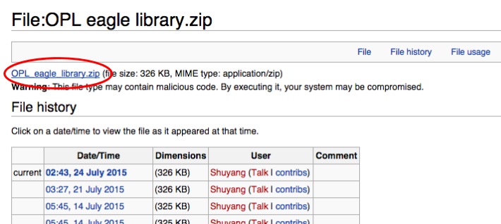

## Getting Libraries

#### TODO:

* [x] sequence 
* [ ] captions 
* [ ] images

In this section we'll go over how to add libraries to your project.

As an example, we'll go over how to add the libraries for SEEED's OPL.

### Get Files on This Page

go to the following link and download the library (circled in red below):

http://www.seeedstudio.com/wiki/File:OPL_eagle_library.zip

### Set Libraries in Eagle

### Check in Add Parts to make sure you have the files
