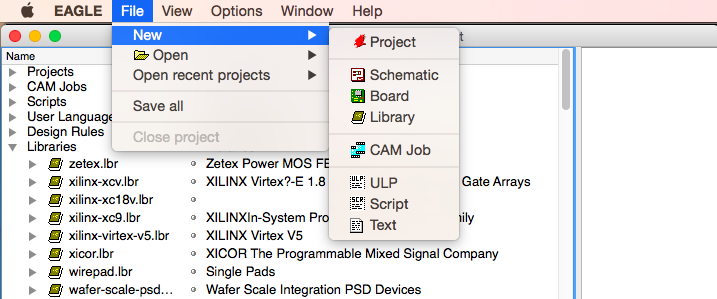
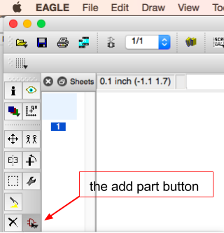
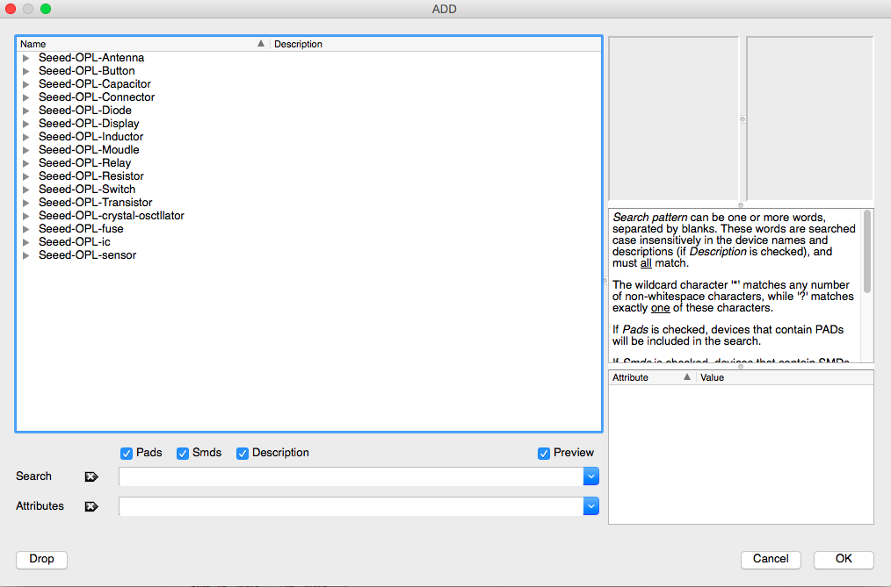

## Getting Libraries

#### TODO:

* [x] sequence 
* [ ] captions 
* [ ] images

In this section we'll go over how to add libraries to your project.

As an example, we'll go over how to add the libraries for SEEED's OPL.

### Step 1) Download The Parts

#### go to the following link and download the library (circled in red below):

http://www.seeedstudio.com/wiki/File:OPL_eagle_library.zip

---

### Step 2) Place the parts in your library (lbr)

#### unzip the opl zip and paste into your eagle's lbr (for me this was `EAGLE-6.6.0/lbr`)

---

### Step 3) Activate The Libraries

#### 3a) Open the Eagle Program and go to the "Library folder" as in the image below:

---

#### 3b) Scroll down to OPL Eagle Library

---

#### 3c) Right click on folder and click "use all"

---

#### 3d) check that everything should now has green dots

---

## Step 4) Test that they are enabled

#### 4a) Click "File" then "New Schematic"

---

#### 4b) Click the add Button

---

#### 4c) You should now have (somewhere in your options) the Opl Components:

Woot! You're all geared up, time to make some hardware!
